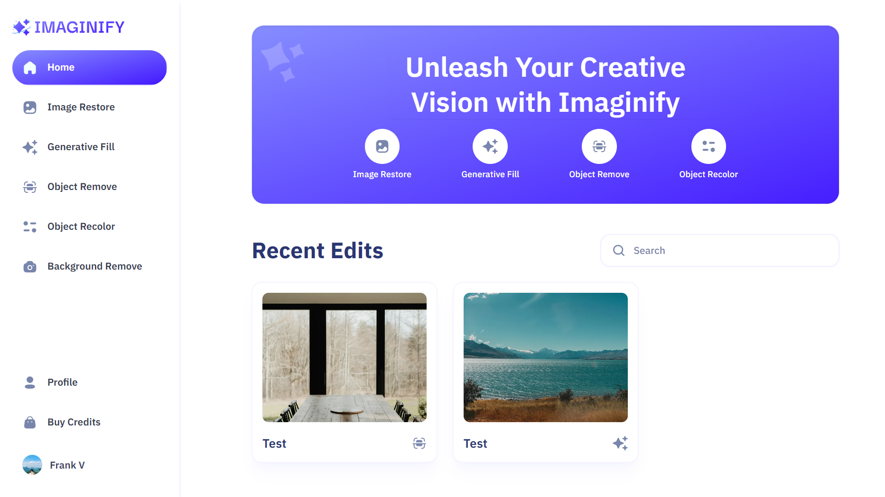

<div align="center">
    <a href="https://imaginify-fv.vercel.app" target="_blank">
      
    </a>
  <h3 align="center">Imaginify - Canva clone</h3>
</div>

##  <br /> 📋 <a name="table">Table of Contents</a>

- ✨ [Introduction](#introduction)
- ⚙️ [Tech Stack](#tech-stack)
- 📝 [Features](#features)
- 🚀 [Quick Start](#quick-start)

##  <br /> <a name="introduction">✨ Introduction</a>

**[EN]** An AI image SaaS platform that excels in image processing capabilities, integrates a secure payment infrastructure, offers advanced image search functionalities, and supports multiple AI features—including image restoration, recoloring, object removal, generative filling, and background removal.

**[FR]** Une plateforme SaaS d'images IA qui excelle dans les capacités de traitement d'images, intègre une infrastructure de paiement sécurisée, offre des fonctionnalités avancées de recherche d'images, et prend en charge plusieurs fonctionnalités IA, notamment la restauration d'images, la recoloration, la suppression d'objets, le remplissage génératif et la suppression d'arrière-plan.

##  <br /> <a name="tech-stack">⚙️ Tech Stack</a>

- **Next.js** is a React framework that enables server-side rendering, static site generation, and client-side rendering with built-in routing and webpack configuration. It optimizes performance and SEO while providing a great developer experience.

- **TypeScript** is a strongly typed superset of JavaScript that adds static types, allowing for enhanced code quality, better scalability, and improved developer productivity through features like type checking and code refactoring tools.

- **MongoDB** is a NoSQL document database known for its flexibility and scalability. It stores data in JSON-like documents and supports a flexible schema, making it suitable for handling large volumes of unstructured or semi-structured data.

- **Clerk** is a developer-first authentication and user management service that simplifies implementing secure user authentication and authorization features in web applications. It provides pre-built UI components and backend services for managing user sessions, passwords, and permissions.

- **Cloudinary** is a loud-based media management platform that offers image and video storage, transformation, optimization, and delivery services through a powerful API. It simplifies handling media assets in web applications by providing scalable solutions for media storage and delivery.

- **Stripe** is a payment processing platform that allows businesses to accept payments online securely and with ease. It provides APIs and tools for managing payment workflows, handling subscriptions, integrating with e-commerce platforms, and ensuring PCI compliance.

- **Shadcn** is a highly customizable and extensible library, making it a great choice for building component libraries or design systems. You can easily modify the source code of Shadcn UI components to match your project's needs and design guidelines.

- **TailwindCSS** is an utility-first CSS framework that provides a set of pre-designed utility classes for styling web interfaces. It allows developers to quickly build custom designs without writing traditional CSS by composing utility classes directly in HTML elements.

## <br/> <a name="features">📝 Features</a>

👉 **Authentication and Authorization**: Secure user access with registration, login, and route protection.

👉 **Community Image Showcase**: Explore user transformations with easy navigation using pagination

👉 **Advanced Image Search**: Find images by content or objects present inside the image quickly and accurately

👉 **Image Restoration**: Revive old or damaged images effortlessly

👉 **Image Recoloring**: Customize images by replacing objects with desired colors easily

👉 **Image Generative Fill**: Fill in missing areas of images seamlessly

👉 **Object Removal**: Clean up images by removing unwanted objects with precision

👉 **Background Removal**: Extract objects from backgrounds with ease

👉 **Download Transformed Images**: Save and share AI-transformed images conveniently

👉 **Transformed Image Details**: View details of transformations for each image

👉 **Transformation Management**: Control over deletion and updates of transformations

👉 **Credits System**: Earn or purchase credits for image transformations

👉 **Profile Page**: Access transformed images and credit information personally

👉 **Credits Purchase**: Securely buy credits via Stripe for uninterrupted use

👉 **Responsive UI/UX**: A seamless experience across devices with a user-friendly interface


and many more, including code architecture and reusability.

## <br /> <a name="quick-start">🚀 Quick Start</a>

Follow these steps to set up the project locally on your machine.

<br/>**Prerequisites**

Make sure you have the following installed on your machine:

- [Git](https://git-scm.com/)
- [Node.js](https://nodejs.org/en)
- [npm](https://www.npmjs.com/) (Node Package Manager)

<br/>**Cloning the Repository**

```bash
git clone {git remote URL}
```

<br/>**Installation**

Let's install the project dependencies, from your terminal, run:

```bash
npm install
# or
yarn install
```

<br/>**Set Up Environment Variables**

Create a new file named `.env` in the root of your project and add the following content:

```env
#  Clerk
NEXT_PUBLIC_CLERK_PUBLISHABLE_KEY=
CLERK_SECRET_KEY=

#  Clerk URLs
NEXT_PUBLIC_CLERK_SIGN_IN_URL=/sign-in
NEXT_PUBLIC_CLERK_SIGN_UP_URL=/sign-up
NEXT_PUBLIC_CLERK_AFTER_SIGN_IN_URL=/
NEXT_PUBLIC_CLERK_AFTER_SIGN_UP_URL=/

# Clerk Webhook Secret
WEBHOOK_SECRET=

# MongoDB
MONGODB_URL=

# Cloudinary
NEXT_PUBLIC_CLOUDINARY_CLOUD_NAME=
CLOUDINARY_API_KEY=
CLOUDINARY_API_SECRET=

# Stripe
NEXT_PUBLIC_STRIPE_PUBLISHABLE_KEY=
STRIPE_SECRET_KEY=
STRIPE_WEBHOOK_SECRET=

# More
NEXT_PUBLIC_SERVER_URL=
```

Replace the placeholder values with your actual credentials. 
- [Clerk](https://dashboard.clerk.com)
- [Cloudinary](https://console.cloudinary.com)
- [MongoDB](https://cloud.mongodb.com)
- [Stripe](https://dashboard.stripe.com)


<br/>**Running the Project**

Installation will take a minute or two, but once that's done, you should be able to run the following command:

```bash
npm run dev
# or
yarn dev
```

Open [`http://localhost:3000`](http://localhost:3000) in your browser to view the project.


